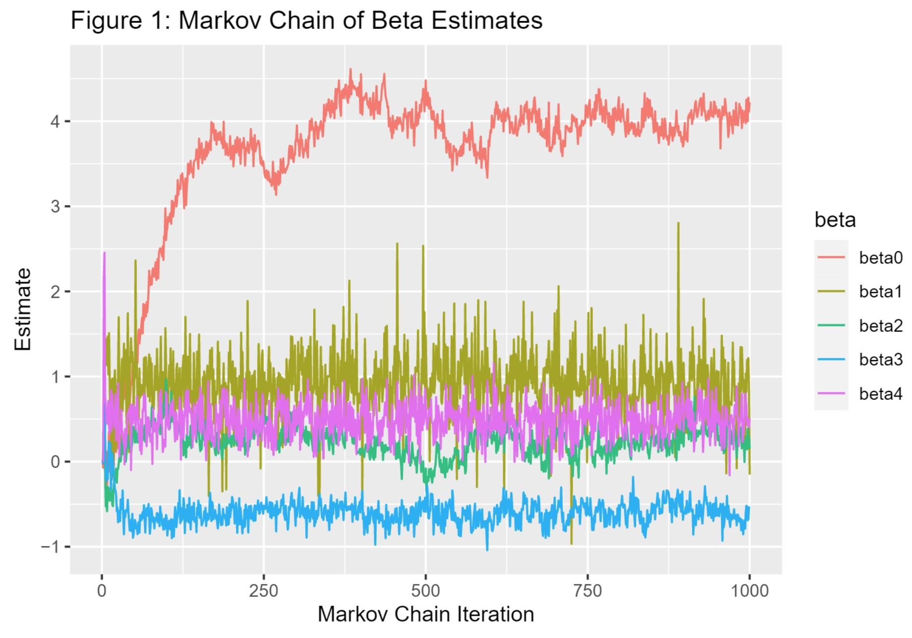
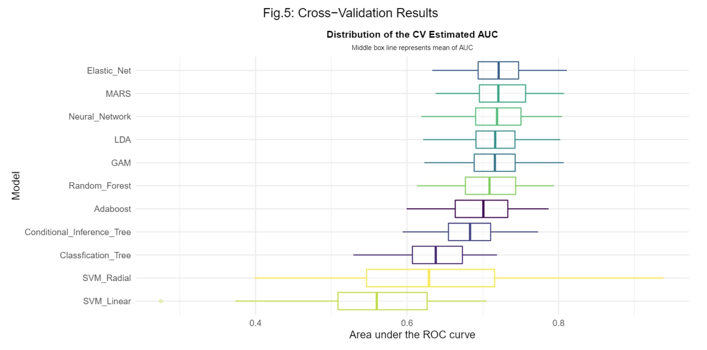

### Education

I received my Master of Science in Biostatistics from the Mailman School of Public Health at Columbia University in May 2023. My coursework included research methods, statistical analysis, machine learning, among other topics. I graduated magna cum laude from [The University of Georgia](https://www.terry.uga.edu/) with a BBA in Finance in May 2018.
 
 

### Professional

Currently, I work for the National Basketball Association (NBA) in data strategy and analytics. In my role, I primarily focus on building and releasing data products and reporting for NBA teams; through this work I analyze new data sources, build new data models, and communicate updates to users. In addition to these responsibilities, I develop predictive models around fan activity and build visualizations of fan activity, particularly geographic visualizations.

During graduate school, I contributed to research projects at both New York Presbyterian and New York University Langone. My primary responsibilities were performing statistical analyses and contributing to methods and results sections of research publications.

From August 2018 through July 2021, I worked as a Business Process Consultant at [Protiviti, Inc.](https://www.protiviti.com/) in the Los Angeles area. This work was project-based with teams from two or three to ten or more members. Projects ranged from entity-level risk assessments with the goal of quantifying relative risk of fraud or loss in various business sectors to performing specific business process audits, such as loan underwriting or financial derivatives management. I gained valuable experience working with diverse teams on a variety of projects in industries including: residential and commercial real estate, community and corporate banking, and clinical stage biopharmaceuticals.
 
 

### Grad School Projects

As a final project in an advanced statistical computing course, we utilized Bayesian methods and a Gibbs Sampling Markov Chain Monte Carlo algorithm to analyze hurricane data and predict future wind speed. The full report on this project can be found [here](https://github.com/tucker-l-morgan/p8160_hurricane/blob/main/Report.pdf). My primary responsibilities on this project included deriving posterior distributions of parameters, writing code for our Gibbs Sampling algorithm, and writing the results and discussion sections of our report.

 

For an end-of-semester group project in a statistical learning course, my group combined work from midterm projects to predict 10-year coronary heart disease (CHD) risk using data from the [Framingham Heart Study](https://www.framinghamheartstudy.org/). In this project, we used the `caret` package in R to fit various models ranging from logistic LASSO to random forest classification and support vector machine. We used area-under-curve (AUC) as our scoring measure and compared the cross-validation performance of all considered models. The final report for this project can be found [here](https://github.com/tucker-l-morgan/p8106_final_project/blob/main/p8106_final_project.pdf). My primary responsibilities on this project included fitting models, collaborating on report figures, and writing the report, particularly strengths and weaknesses of the various model types.

 

In an advanced statistical computing course, our group conducted a simulation study to examine the performance of simple and complex bootstrapping methods in estimating standard errors. Specifically, we looked at this question in the context of propensity-score matching. The project report can be found [here](https://github.com/tucker-l-morgan/p8160_proj1_4_C/blob/main/p8160_proj1_report.pdf). My primary responsibilities included writing algorithms for the generation, bootstrapping, and analysis of continuous outcome data, plotting results like confidence interval coverage rates and standard error estimates, and contributing to the results and discussion sections of the report.

For an end-of-semester group project in our data science course, my group members and I analyzed COVID-19 outcomes data in New York City alongside demographic and socioeconomic data from the U.S. Census. The project, NYC COVID Trends, has its own website [here](https://tucker-l-morgan.github.io/nyc_covid_trends/). My primary responsibilities on this project included data cleaning and conversion, exploratory data analysis, and website development.