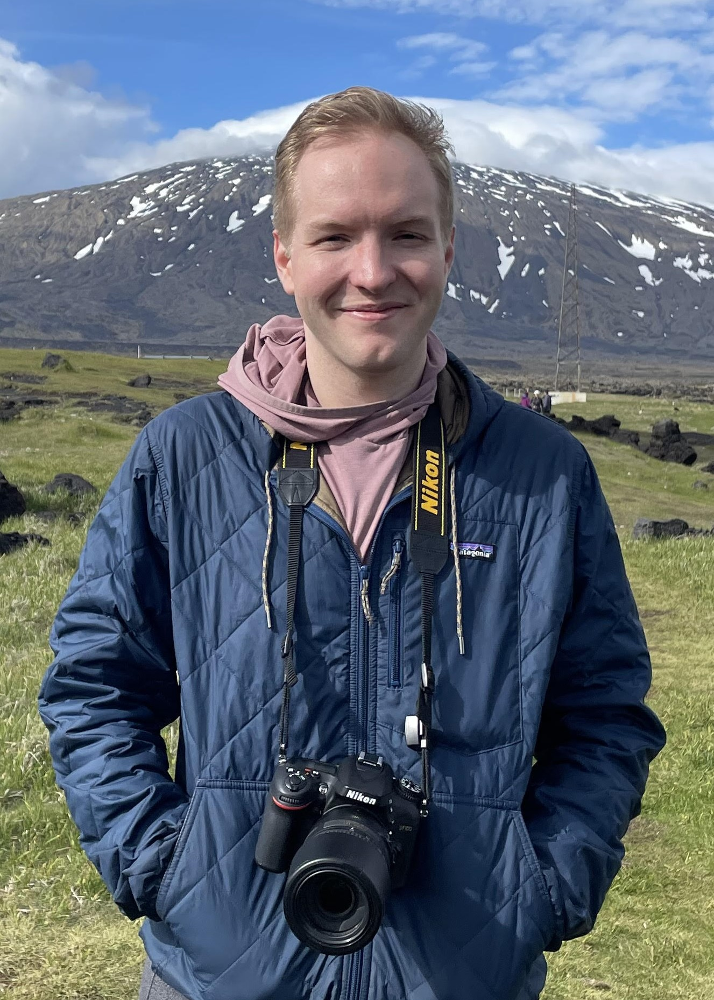

# About

Hello! My name is Tucker. This website includes some high-level info about me, but please feel free to contact me via email or LinkedIn above. I'm a graduate of the Mailman School of Public Health at Columbia University where I received my Master of Science in biostatistics. I'm originally from Georgia and I obtained my BBA in Finance from [The University of Georgia](https://www.terry.uga.edu/) in 2018. For more detailed info on my experience, please see the "Experience" page.

In my personal time, I enjoy hiking and camping. I love to read, and I like to watch NBA basketball. I also love wildlife photography (see me with my Nikon to the left) - you can see my photography work [@tuckersbirds](https://www.instagram.com/tuckersbirds/).